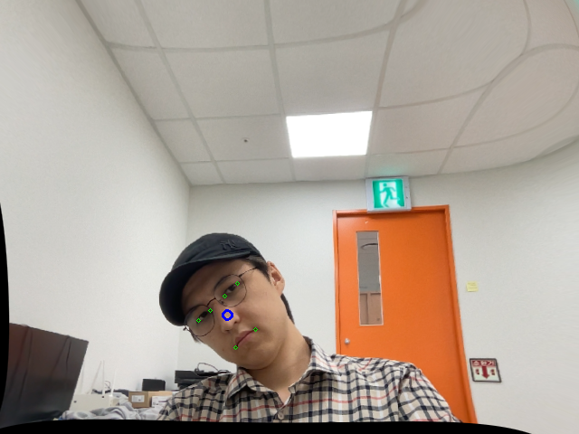
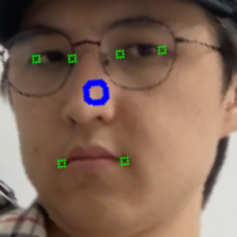

>  بِسْمِ اللهِ الرَّحْمٰنِ الرَّحِيْمِ

# Data Rectification for Gaze Estimation with DL 

> Data Rectification(Data Normalization) has been proposed to address the aforementioned challenge by reducing the training space and making the training more efficient. 

> In a nutshell, data normalization first rotates the camera to warp the eye images so that the x-axis of the camera coordinate system is perpendicular to the y-axis of the head coordinate system. Then, the image is scaled so that the normalized camera is located at a fixed distance away from the eye center. The final eye images have only 2 degrees of freedom in head pose for all the different data.

At [12], authors proposed structured way and tutorial on doing data rectification. More info at https://phi-ai.buaa.edu.cn/Gazehub/rectification/

### History of Data Rectification (previously called as "Data Normalization"):

To better understand the current situation in Data Rectification for Gaze Estimation, check out this link below.
Source: https://github.com/xucong-zhang/data-preprocessing-gaze?tab=readme-ov-file#history-of-data-normalization-for-gaze-estimation

## DEMO
Input: 
Output:  

## SETUP
1. Clone the repository
2. Create conda environment
3. Install requirements `pip install -r requirements.txt`
4. Use [11] to find camera_matrix and distortion value of your camera. Bring the calibration file (.pkl) to current repository
4. Run `python main.py`

### Different 3D Models used in literature
1. [sfm_face_coordinates.npy](sfm_face_coordinates.npy) - used at [8]
2. [face_model.txt](face_model.txt) - used at [9]
3. [6 points-based facemodel.mat](6_points-based_face_model.mat) - used at [2]
4. sfm_shape_3448.bin - used at [13]

## Reference: 
[1] Revisiting Data Normalization for Appearance-Based Gaze Estimation. Zhang et al. ETRA 2018.

[2] https://github.com/xucong-zhang/data-preprocessing-gaze

[3] https://github.com/swook/faze_preprocess

[4] https://github.com/Abecid/Data-Normalization-for-Appearance-Based-Gaze-Estimation

[5] https://github.com/X-Shi/Data-Normalization-Gaze-Estimation

[6] https://github.com/AlessandroRuzzi/GazeNeRF

[7] https://phi-ai.buaa.edu.cn/Gazehub/2D-dataset/

[8] https://github.com/NVlabs/few_shot_gaze

[9] https://github.com/xucong-zhang/ETH-XGaze/blob/master/normalization_example.py

[10] https://stackoverflow.com/questions/44888119/c-opencv-calibration-of-the-camera-with-different-resolution

[11] https://github.com/AbdirayimovS/camera_calibration

[12] Appearance-based Gaze Estimation With Deep Learning: A Review and Benchmark. Yihua Cheng and Haofei Wang and Yiwei Bao and Feng Lu. 2021

[13] https://github.com/zhengyuf/STED-gaze